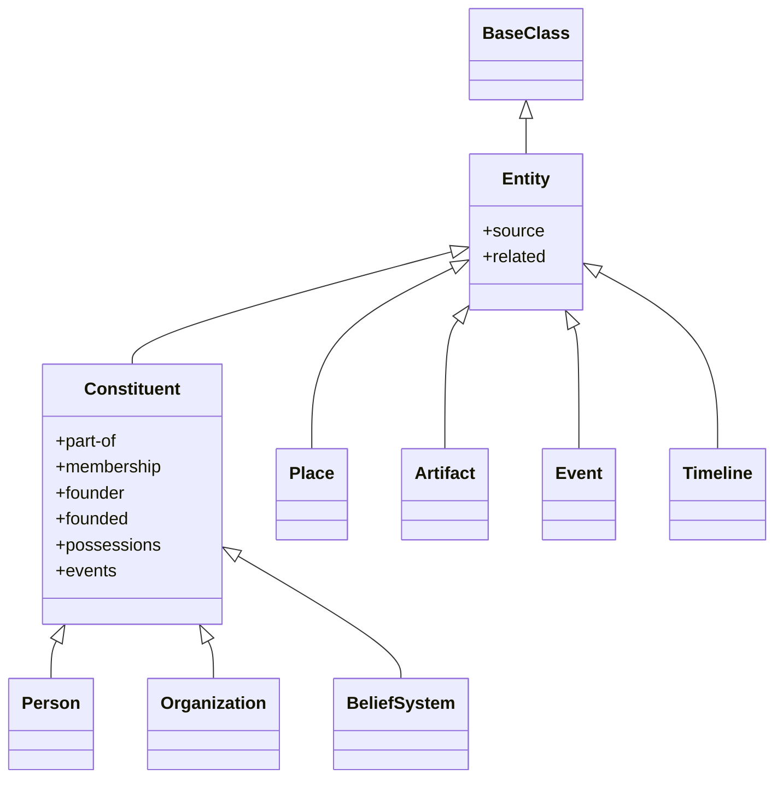
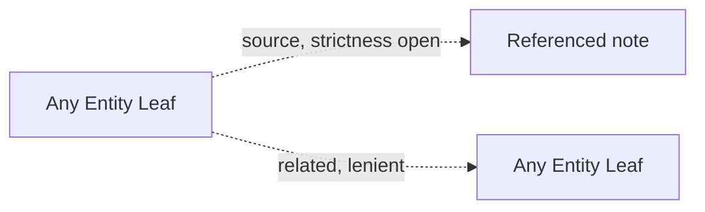
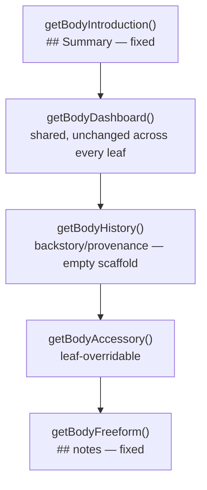
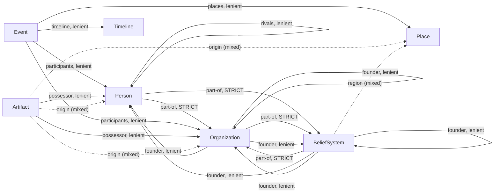
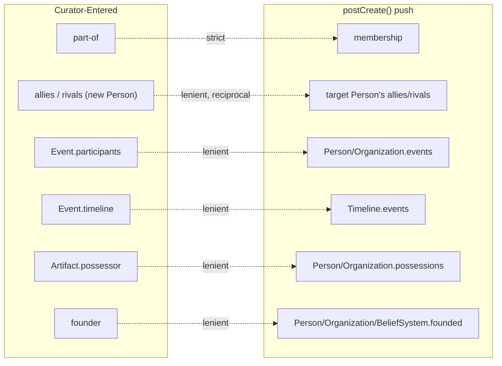

Schema reference and visualization for `Entity.js`, aligned with [[Entity.js Specification]]. Scope matches the specification exactly: `Entity`, `Constituent`, and the seven core leaves. Module-specific extensions (`LibraryEntity`, `CreativeEntity`, etc.) are out of scope for both documents.

## Contents
---
```toc
```

## 1. Legend
---

| Diagram notation | Meaning |
| --- | --- |
| `──►` solid arrow | Relational field, **eager-strict** resolution (throws on unresolved link) |
| `┄┄►` dashed arrow | Relational field, **eager-lenient** resolution (tolerates unresolved link) |
| `····►` dotted arrow | **Cascade-only** field — populated by a `postCreate()` push, no modal field |
| `╌╌►` mixed-style arrow | Relational-or-free-text field (`resolveOptionalNoteTitle()`) — relational when bracketed, free text otherwise; throws only if a bracketed value fails to resolve |

## 2. Class Hierarchy
---



- `Entity` and `Constituent` are both real, shared, never-instantiated classes.
- `Person`/`Organization`/`Belief-System` extend `Constituent`. The remaining four leaves extend `Entity` directly.
- All seven leaves are directly instantiable, each with its own creation command — no leaf is abstract.

## 3. Entity-Level Shared Fields
---

| Field | Type | Resolution |
| --- | --- | --- |
| `source` | wikilink array | Eager. Strictness not fixed at this tier — see [[Entity.js Specification]] §10. |
| `related` | wikilink array | Eager-lenient (`resolveNoteLinksLenient()`). |
| `class`, `category`, `affiliations`, `created`, `modified`, `context`, `tags` | — | Standard via `BaseClass`. |



## 4. Body Composition
---



`getBodyDashboard()` renders a `source` table, a `related` table, and an `affiliations`-by-namespace breakdown (grouping the note's own `affiliations` values by [[Apparatus Affiliations Taxonomy]] category prefixes). This is the only body section that queries `affiliations` directly — every leaf-specific relational field lives in `getBodyAccessory()` instead (§7).

## 5. Constituent Fields
---

| Field | Type | Resolution | Curator-enterable? |
| --- | --- | --- | --- |
| `part-of` | wikilink array | Eager-strict | Yes — the sole curator-enterable side. |
| `membership` | wikilink array | — | No. Cascade-only; reverse of `part-of`. |
| `founder` | wikilink array | Eager-lenient, triple-class (`Person`/`Organization`/`Belief-System`) | Yes — `Organization`/`Belief-System` only. |
| `founded` | wikilink array | — | No. Cascade-only; reverse of `founder`. |
| `possessions` | wikilink array | — | No. Cascade-only; reverse of `Artifact.possessor`. |
| `events` | wikilink array | — | No. Cascade-only; reverse of `Event.participants`. |

`Organization` uses all six; `Person` uses `part-of`/`founded`/`possessions`/`events`; `Belief-System` uses `part-of`/`membership`/`founder`/`founded`.

## 6. Per-Leaf Field Schemas
---

### 6.1 Person

| Field | Type | Kind | Resolution / Vocabulary |
| --- | --- | --- | --- |
| `category` | string array | controlled vocabulary | Real/fictional axis confirmed; remainder undefined. |
| `aliases` | string array | free text | Obsidian native property. |
| `role` | string | free text | — |
| `significance` | string | free text | — |
| `occupation` | string | free text | — |
| `alignment-ethics` | string | controlled vocabulary | `lawful`/`neutral`/`chaotic` |
| `alignment-morality` | string | controlled vocabulary | `good`/`neutral`/`evil` |
| `allies` | wikilink array | relational | Eager-lenient, scoped to `Person`. |
| `rivals` | wikilink array | relational | Eager-lenient, scoped to `Person`. |
| `part-of`, `founded`, `possessions`, `events` | — | via `Constituent` | See §5. |

Naming convention: last name, first name. No split name fields.

### 6.2 Organization

| Field | Type | Kind | Resolution / Vocabulary |
| --- | --- | --- | --- |
| `category` | string array | controlled vocabulary, open-ended | `family`/`faction`/`political-party`/`guild` |
| `part-of`, `membership`, `founder`, `founded`, `possessions`, `events` | — | via `Constituent` | See §5 — the only leaf using all six. |

### 6.3 Belief-System

| Field | Type | Kind | Resolution / Vocabulary |
| --- | --- | --- | --- |
| `category` | string array | controlled vocabulary, 4 axes, 2 conditional | Domain (pick-one): `political`/`religious`. Political sub-axis (shown only if `political`): `first-party`/`third-party`/`independent`. Religious sub-axis (shown only if `religious`): `mainstream`/`denomination`/`cult`/`individual`. Ethical leaning (stackable): `benevolent`/`benevolent-neutral`/`neutral`/`neutral-malevolent`/`malevolent`. |
| `date-start` / `date-end` | date | free text | Optional; absent `date-end` implies a single point. |
| `region` | wikilink or string | mixed | `resolveOptionalNoteTitle()`, scoped to `Place`. |
| `part-of`, `membership`, `founder`, `founded` | — | via `Constituent` | See §5. No `possessions`/`events`. |

### 6.4 Place

| Field | Type | Kind | Resolution / Vocabulary |
| --- | --- | --- | --- |
| `category` | string array | controlled vocabulary, pick-one | `region`/`settlement`/`landmark`/`structure` |

No fields beyond `Entity`/`BaseClass`. Containment uses `related`.

### 6.5 Artifact

| Field | Type | Kind | Resolution / Vocabulary |
| --- | --- | --- | --- |
| `category` | string array | controlled vocabulary, 2 stackable + 1 pick-one | Nature (stackable): `mundane`/`technological`/`supernatural`. Function (stackable): `weapon`/`relic`/`document`/`tool`. Temperament (pick-one): `cursed`/`blessed`/`neutral`. |
| `possessor` | wikilink array | relational | Eager-lenient, dual-class: `Person`/`Organization`. |
| `origin` | wikilink or string | mixed | `resolveOptionalNoteTitle()`, `NoteSuggest`-scoped to `Person`/`Place`/`Organization`. |
| `condition` | string | controlled vocabulary | `intact`/`damaged`/`lost`/`destroyed`/`unknown`/`hidden` |

### 6.6 Event

| Field | Type | Kind | Resolution / Vocabulary |
| --- | --- | --- | --- |
| `category` | string array | controlled vocabulary, 2 stackable | Scale: `personal`/`local`/`regional`/`world-historic`. Nature: `war`/`disaster`/`political`/`discovery`/`ritual`. |
| `date-start` | date | free text | Always present. |
| `date-end` | date | free text | Optional; absence implies single-day/point event. |
| `participants` | wikilink array | relational | Eager-lenient, dual-class: `Person`/`Organization`. |
| `places` | wikilink array | relational | Eager-lenient, scoped to `Place`. |
| `timeline` | wikilink (singular) | relational | Eager-lenient, scoped to `Timeline`. |

### 6.7 Timeline

| Field | Type | Kind | Resolution / Vocabulary |
| --- | --- | --- | --- |
| `category` | — | none | — |
| `events` | wikilink array | relational | Cascade-only, populated from `Event.timeline`. |
| `date-start` / `date-end` | date | free text | Same shape as `Event`; describes the Timeline's own span. |

Subject-tracing uses `related`.

## 7. Relational Connections — Curator-Entered Fields
---



`membership`/`founded`/`possessions`/`events` do not appear here — all four are cascade-only. See §8.

## 8. Accession
---

| Row | Resolves | Pushes into | Target field | Strictness |
| --- | --- | --- | --- | --- |
| 1 | Every wikilink in `part-of` | Each resolved `Organization`/`Belief-System` | `membership` | Strict |
| 2 | A named `Person` in `allies`/`rivals`, at creation time only | The resolved `Person` | `allies`/`rivals` (whichever matched) | Lenient — reciprocal |
| 3 | Every wikilink in `Event.participants` | Each resolved `Person`/`Organization` | `events` | Lenient |
| 4 | The wikilink in `Event.timeline`, if set | The resolved `Timeline` | `events` | Lenient |
| 5 | Every wikilink in `Artifact.possessor` | Each resolved `Person`/`Organization` | `possessions` | Lenient |
| 6 | Every wikilink in `founder` (`Organization`/`Belief-System`) | Each resolved `Person`/`Organization`/`Belief-System` | `founded` | Lenient |



Row 2 is the only reciprocal push — both sides are independently curator-enterable. Every other row is one-sided: one curator-enterable field, one cascade-only field. All pushes are duplicate-safe and throw-and-log on failure without blocking the primary note's creation.

## 9. Open Items
---

Mirrors [[Entity.js Specification]] §10 exactly.

1. **`source`'s resolution strictness is not fixed at this tier.** Left to whichever concrete `*Entity` extends this shape.
2. **`Belief-System.category`'s domain-conditional sub-axes require new modal logic** — no existing pattern in this system supports a sub-axis that only appears once a parent axis value is selected.
3. **`Person.category`'s vocabulary is incomplete** — only the real/fictional axis is confirmed, and even its value names are provisional.
4. **`Organization.category`'s vocabulary is open-ended by design**, not a closed list.

## 10. Change Log
---

| Date | Change |
| --- | --- |
| 2026-09-12 | Resolved the "Accession-shaped but not formally Accession" open item, mirroring [[Entity.js Specification]]'s own §5/§10/§11 update: renamed §8 from "Cross-Object Relational Population" to "Accession"; removed the corresponding open item from §9 and renumbered the remaining three. |
| 2026-08-28 | Initial schema document. |
| 2026-08-31 | Full rebuild to align with the finalized [[Entity.js Specification]]. Removed all `LibraryEntity`/`CreativeEntity`/module-branch content — out of scope for both documents now. Corrected the hierarchy diagram (`Constituent` is a single real shared class, not two module-specific realizations with no shared file). Corrected `part-of`/`membership` direction throughout (§7/§8) to match the specification's resolved design. Added `founder`/`founded`, `possessor`/`possessions`, `alignment-ethics`/`alignment-morality`; removed the deprecated `ally.`/`rival.`/`subject.` namespace pattern and the retired `era` field. Added the `getBody()` five-method composition diagram (§4). Replaced the prior open-items list with the five items now tracked in the specification's own §10. |