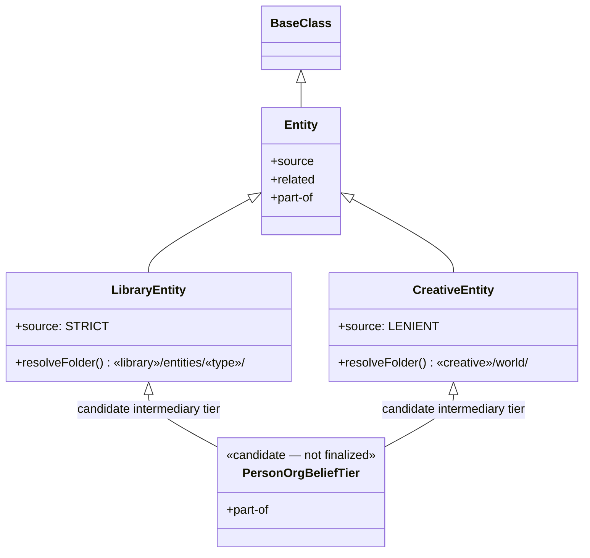
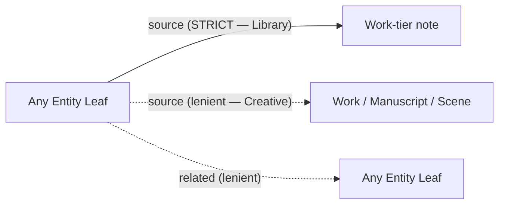
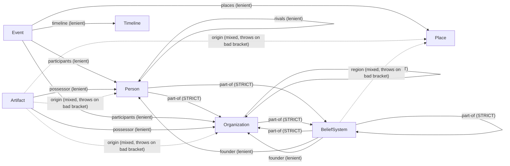
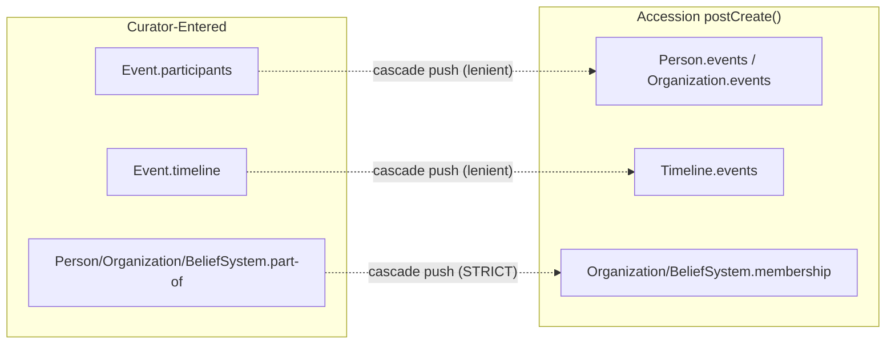

Schema reference for `Entity.js` and its leaves, derived from the Entity Worksheet. This document visualizes what's been settled so far — class hierarchy, full field sets per leaf, and every relational connection between leaves. Anything not yet resolved in the worksheet is marked **OPEN** here rather than drawn as settled fact.

## Contents
---
```toc
```

## 1. Legend
---

| Diagram notation | Meaning |
| --- | --- |
| `──►` solid arrow | Relational field, **eager-strict** resolution (throws on unresolved link) |
| `┄┄►` dashed arrow | Relational field, **eager-lenient** resolution (tolerates unresolved link) |
| `····►` dotted arrow | **Cascade-only** field — populated by Accession's `postCreate()`, no modal field, not curator-enterable |
| `╌╌►` mixed-style arrow | Relational-or-free-text field (`resolveOptionalNoteTitle()` pattern) — relational when bracketed, free text otherwise; throws only if a bracketed value fails to resolve |
| **OPEN** label | Not yet settled in the worksheet — drawn to show where the connection *would* go, not to assert its final shape |

## 2. Class Hierarchy
---



- `Entity` is never instantiated directly; neither is `LibraryEntity`/`CreativeEntity`.
- The dashed "candidate intermediary tier" node represents the still-unfinalized §2.3 discussion — `Person`/`Organization`/`Belief-System` share `part-of`; `Organization`/`Belief-System` additionally share the reverse-lookup `membership` (`Person` does not carry `membership` — nothing has "members" the way an Organization or Belief-System does). May or may not warrant a real intervening class. Drawn here to make the *shape* of that open question visible, not to assert it exists yet.
- Below `LibraryEntity`/`CreativeEntity` (or the candidate tier, if it materializes), each module independently implements its own copy of all seven leaves — **Person**, **Organization**, **Place**, **Artifact**, **Belief-System**, **Event**, **Timeline** — one class per file per module, per the vault's one-class-per-file convention. They share field *names* and mostly share field *shapes*, but are separate classes, not one shared leaf reused across modules.

## 3. Entity-Level Shared Fields
---

Owned by `Entity.js` itself — inherited unchanged by every leaf in both modules, except where noted.

| Field | Type | Resolution | Module differences |
| --- | --- | --- | --- |
| `source` | wikilink array | Eager | **Strict** in `LibraryEntity` (throws if unresolved) · **Lenient** in `CreativeEntity` (`resolveNoteLinksLenient()`) |
| `related` | wikilink array | Eager-lenient (`resolveNoteLinksLenient()`) | None — uniform in both modules |
| `class`, `category`, `affiliations`, `created`, `modified`, `context`, `tags` | — | Standard via `BaseClass` | None |

`part-of` does **not** live here. It was reassigned specific, non-generic semantics scoped to the `Person`/`Organization`/`Belief-System` cluster — see §4.1/§4.2/§4.7. Not a shared Entity-wide field.



**Note**: `source`'s exact target scope (which specific Work-tier classes it can point at) and `related`'s target scope (whether it's restricted to Entity leaves only, or can also point at Work-tier notes) were never explicitly pinned down in the worksheet — carried over from the equivalent Work-tier fields' own unscoped pattern by inference, not independently confirmed for Entity. Flagging as **OPEN** rather than asserting a specific scope.

## 4. Per-Leaf Field Schemas
---

### 4.1 Person

| Field | Type | Kind | Resolution | Vocabulary / Target |
| --- | --- | --- | --- | --- |
| `category` | string array | controlled vocabulary | dropdown/multi-select | `real`/`fictional` (naming TBD) confirmed as one axis; remainder **OPEN** |
| `aliases` | string array | free text | Obsidian native property | — |
| `role` | string | free text | — | — |
| `significance` | string | free text | — | — |
| `occupation` | string | free text | — | — |
| `allies` | wikilink array | relational | eager-lenient | scoped to `Person` |
| `rivals` | wikilink array | relational | eager-lenient | scoped to `Person` |
| `part-of` | wikilink array | relational | eager-**strict** | scoped to `Organization`/`Belief-System`. Names what this Person belongs to. |
| `events` | wikilink array | relational | **cascade-only** via Accession | populated from `Event.participants`; no modal field |
| `era` | string | free text | — | **Creative-side only** — not present on Library's `Person` |

Naming convention: last name, first name. No split name fields (`prefix`/`first-name`/`last-name`/`suffix`) — that split exists on `Author.js` specifically for Accession's citation-sorting needs, which `Person` doesn't share.

### 4.2 Organization

Supersedes the struck `Group` candidate.

| Field | Type | Kind | Resolution | Vocabulary / Target |
| --- | --- | --- | --- | --- |
| `category` | string array | controlled vocabulary | dropdown/multi-select | `family`/`faction`/`political-party`/`guild` — non-exhaustive |
| `part-of` | wikilink array | relational | eager-**strict** | scoped to `Organization`/`Belief-System`. An Organization can itself belong to a larger Organization/Belief-System. |
| `membership` | wikilink array | relational | **cascade-only** via Accession | populated from any Person/Organization/Belief-System naming this Organization in its own `part-of`; no modal field |
| `events` | wikilink array | relational | **cascade-only** via Accession | populated from `Event.participants`; no modal field |

### 4.3 Event

Exists on both modules.

| Field | Type | Kind | Resolution | Vocabulary / Target |
| --- | --- | --- | --- | --- |
| `category` | string array | controlled vocabulary, stackable | multi-select | Scale: `personal`/`local`/`regional`/`world-historic` · Nature: `war`/`disaster`/`political`/`discovery`/`ritual` |
| `date-start` | date | free text (Creative) / literal date (Library) | — | always present |
| `date-end` | date | free text (Creative) / literal date (Library) | — | absent implies single-day/point event |
| `participants` | wikilink array | relational | eager-lenient | dual-class: `Person`/`Organization` |
| `places` | wikilink array | relational | eager-lenient | scoped to `Place` |
| `timeline` | wikilink (singular) | relational | eager-lenient | scoped to `Timeline`; cascades into `Timeline.events` via Accession |

Time-of-day is explicitly out of scope — dates only, time left to body prose.

### 4.4 Timeline

Exists on both modules. Not a bare index — carries its own substantive content (character-arc descriptions, organizational history, thematic throughlines).

| Field | Type | Kind | Resolution | Vocabulary / Target |
| --- | --- | --- | --- | --- |
| `category` | — | none | — | No vocabulary defined — may be revisited after real use |
| `events` | wikilink array | relational | **cascade-only** via Accession | populated from `Event.timeline`; no modal field |
| `date-start` / `date-end` | date | same type split as Event | — | describes Timeline's own overall span, stored directly |

Subjects (whose arc/history a Timeline traces) are **not** a stored field — handled via `affiliations` namespacing (`subject.<person>`, `subject.<organization>`), matching the `ally.`/`rival.` namespacing pattern on `Person`.

### 4.5 Place

Exists on both modules. Deliberately the leanest leaf.

| Field | Type | Kind | Resolution | Vocabulary / Target |
| --- | --- | --- | --- | --- |
| `category` | string array | controlled vocabulary, pick-one | dropdown | `region`/`settlement`/`landmark`/`structure` |

No fields beyond `Entity`/`BaseClass`. Containment (`structure` within `settlement` within `region`) uses `related`, not `part-of` — `part-of` was repurposed with specific, non-generic Person/Organization/Belief-System semantics (§4.1/§4.2/§4.7) and no longer carries loose Entity-wide meaning. Events occurring at a Place are surfaced via a Dataview table (reading `Event.places`), not a stored reverse field.

### 4.6 Artifact

Exists on both modules.

| Field | Type | Kind | Resolution | Vocabulary / Target |
| --- | --- | --- | --- | --- |
| `category` | string array | controlled vocabulary, stackable + one pick-one axis | multi-select | Nature (stackable): `mundane`/`technological`/`supernatural` · Function (stackable): `weapon`/`relic`/`document`/`tool` · Temperament (pick-one): `cursed`/`blessed`/`neutral` |
| `possessor` | wikilink array | relational | eager-lenient | dual-class: `Person`/`Organization`; may be empty |
| `origin` | wikilink or string | relational-or-free-text | `resolveOptionalNoteTitle()` — free text passes through untouched; a bracketed value resolves and **throws** on failure | `NoteSuggest`-scoped to `Person`/`Place`/`Organization` in the modal |
| `condition` | string | controlled vocabulary | dropdown | `intact`/`damaged`/`lost`/`destroyed`/`unknown`/`hidden` |

No `location` field (redundant with `possessor`). No `artifacts` field on `Event` — an artifact's presence at an Event stays in `related`. Provenance/possession history is body prose; `possessor` stores only the *current* holder.

### 4.7 Belief-System

Exists on both modules.

| Field | Type | Kind | Resolution | Vocabulary / Target |
| --- | --- | --- | --- | --- |
| `category` | string array | controlled vocabulary, four axes, two conditional | multi-select + **new conditional modal logic required** | Domain (pick-one): `political`/`religious` · Political sub-axis (conditional on `political`): `first-party`/`third-party`/`independent` · Religious sub-axis (conditional on `religious`): `mainstream`/`denomination`/`cult`/`individual` · Ethical leaning (stackable, independent): `benevolent`/`benevolent-neutral`/`neutral`/`neutral-malevolent`/`malevolent` |
| `founder` | wikilink array | relational | eager-lenient | dual-class: `Person`/`Organization`; optional |
| `part-of` | wikilink array | relational | eager-**strict** | scoped to `Organization`/`Belief-System`. A Belief-System can itself belong to a larger Organization/Belief-System. |
| `membership` | wikilink array | relational | **cascade-only** via Accession | populated from any Person/Organization/Belief-System naming this Belief-System in its own `part-of`; no modal field |
| `date-start` / `date-end` | date | same type split as Event/Timeline | — | optional |
| `region` | wikilink or string | relational-or-free-text | `resolveOptionalNoteTitle()` — same pattern as `Artifact.origin` | scoped to `Place`; used when scope is anything but global (scope not yet formalized as a category value — **OPEN**) |

Postulates/doctrine and history are body-prose sections, not frontmatter. Dashboard surfaces an adherent list (not a count) via Dataview against `membership`.

## 5. Relational Connections — Curator-Entered Fields
---

Every field below is directly enterable in a leaf's own modal (except where marked cascade-only, covered separately in §6).



`membership` does not appear here — it is cascade-only (no modal field on any leaf), populated automatically from `part-of`. See §6.

## 6. Accession Cascades — Populated Automatically, Not Curator-Enterable
---

These fields have no modal input. They're populated by another leaf's `postCreate()` hook, mirroring the existing Library-module Accession pattern (`Work.authors` → `Author.works`, `Collection.periodical` → `Periodical.collections`).



| Push | Strictness | Notes |
| --- | --- | --- |
| `Event.participants` → `Person.events` / `Organization.events` | Lenient | Mirrors `Work.authors` → `Author.works` structurally |
| `Event.timeline` → `Timeline.events` | Lenient | Mirrors `Collection.periodical` → `Periodical.collections` structurally |
| `part-of` → `membership` | **Strict** | `part-of` is the sole curator-enterable side (on `Person`/`Organization`/`Belief-System`); `membership` is cascade-only, and only exists on `Organization`/`Belief-System` — `Person` has no `membership` field, since nothing has "members" the way an Organization/Belief-System does. Previously an unresolved "cross-membership" design flaw; now resolved by this split. |

All Accession failures currently throw-and-log via `Log.error` with no persistent record — a separate tracked upgrade (§8 of the Entity Worksheet) proposes durable failure logging. Not yet built; doesn't block this schema.

## 7. Open / Tabled — Not Yet Resolved
---

These are drawn above where relevant, but explicitly **not** settled. Listed here so nothing in §5/§6 is mistaken for a final answer.

1. **Belief-System's participation in `Event`.** Currently `participants` only allows `Person`/`Organization`. Whether a Belief-System can participate directly in an Event (a schism, a founding) — requiring a triple-class allowance — is undecided; current fallback is `related`/body prose, the same resolution reached for `Place`.
2. **`source`/`related`'s exact target scope.** Whether these Entity-level fields are restricted to other Entity leaves, can also target Work-tier notes, or are entirely unscoped, was never explicitly confirmed — carried over by inference from the Work-tier fields' own pattern.
3. **Timeline/Event's ultimate fit under `Entity`** (§2.1 of the worksheet) — resolvable now that all seven leaves are drafted; a full side-by-side comparison confirming genuine field overlap hasn't been explicitly written up yet, though the drafted fields above suggest Timeline/Event fit reasonably well (both share the `date-start`/`date-end` shape, and Event connects into the same `participants`/dual-class pattern used elsewhere).
4. **Belief-System's domain-conditional category axes** require new modal logic (§4.7) — no existing `buildCategorySetting()` pattern supports a sub-axis that only appears once a parent axis value is picked.

**Resolved since the initial version of this document**: the `membership` cross-push mechanics (previously item 1 here) were fixed by splitting the field into `part-of` (curator-entered, all three leaves) and `membership` (cascade-only, `Organization`/`Belief-System` only) — see §4.1/§4.2/§4.7 and §6.

## 8. Change Log
---

| Date | Change |
| --- | --- |
| 2026-08-28 | Initial schema document, generated from the Entity Worksheet as of this date. Covers class hierarchy, Entity-level shared fields, full per-leaf field schemas for all seven leaves, curator-entered relational connections, Accession cascade behavior, and a consolidated list of open/tabled items not to be mistaken for settled design. |
| 2026-08-28 | Corrected throughout to match the worksheet's `part-of`/`membership` redesign: `part-of` (not `membership`) is now the curator-entered field shared by `Person`/`Organization`/`Belief-System`, always an array, eager-strict; `membership` is cascade-only via Accession and exists only on `Organization`/`Belief-System` (removed an erroneously-included `membership` row from `Person`'s table). Updated the class hierarchy diagram, Person/Organization/Belief-System field tables, Place's containment note (now `related`, not `part-of`), the §5 relational diagram, and the §6 Accession cascade diagram and table accordingly. Removed the resolved cross-membership item from §7 and added a note recording its resolution. |